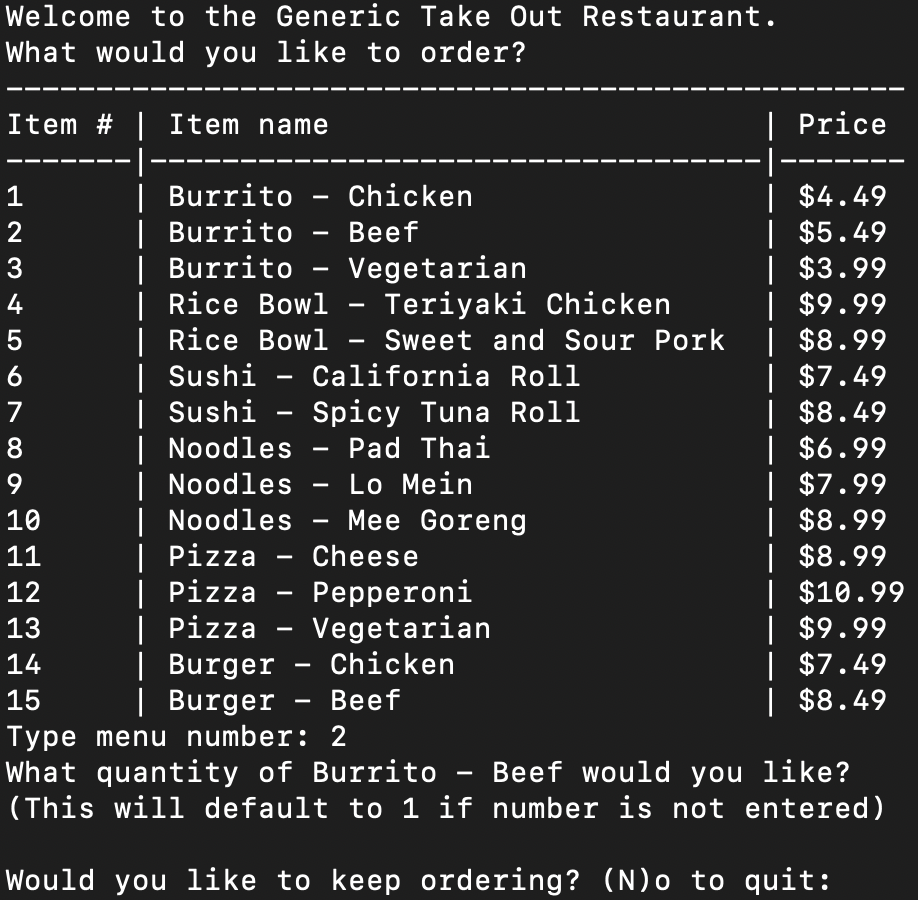
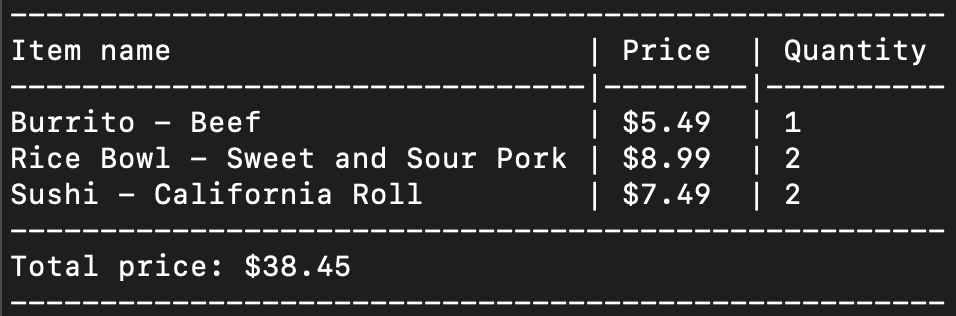
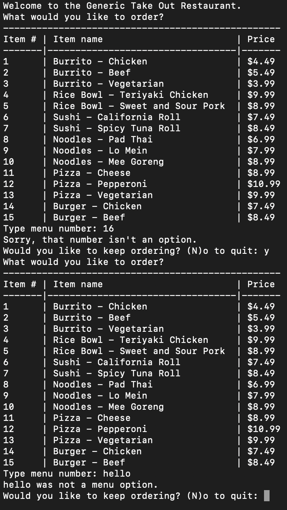

# CLI_Takeout_Menu
A CLI application that simulates a takeout menu for ordering food 

ACCEPTANCE CRITERIA: 
GIVEN A restaurant order system
WHEN I launch the program
THEN I view all of the menu items listed with their category, name, and price
WHEN I select an item from the menu by entering a number
THEN I am asked the quantity of that item I want to order
WHEN I choose the quantity
THEN I am asked if I would like to continue ordering or not
WHEN I don't choose a valid quantity
THEN I automatically receive 1 of that menu item
WHEN I continue ordering
THEN I view the menu again
WHEN I quit ordering
THEN I am shown my itemized order receipt and total price
WHEN I enter an invalid response for the menu item
THEN I am given an error message

  

## MOCK-UP:   
   

## RECEIPT:  
  

## INCORRECT INPUT:   
   